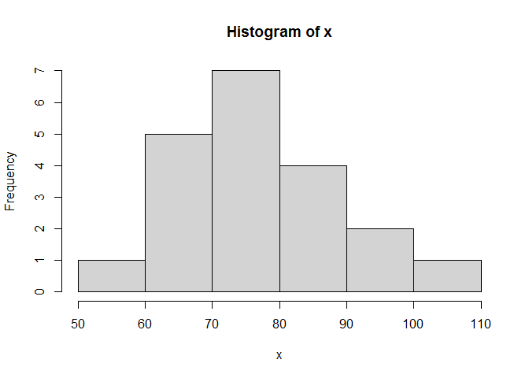
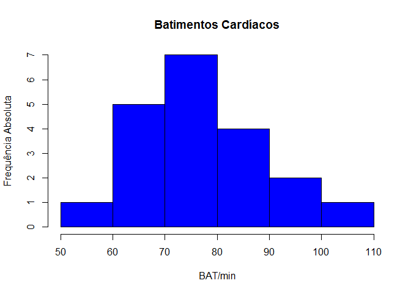
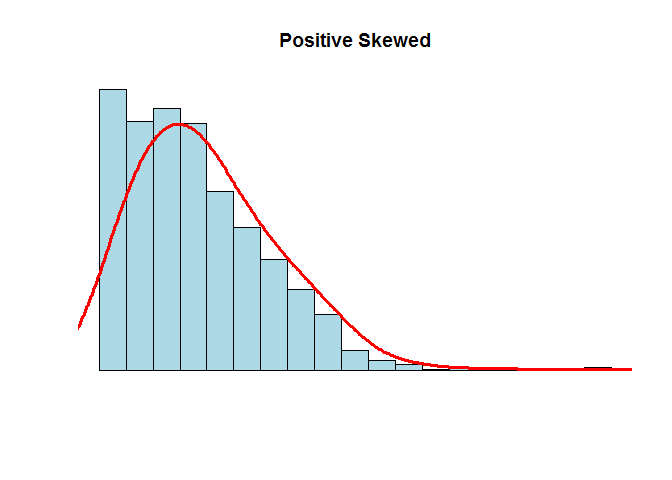

Atividade Avaliativa 1
================
Magno Mota Pereira </br>
27/07/2021

------------------------------------------------------------------------

**Questão 01**

**a)** Ele errou porque ele não calculou o intervalo fora do block post,
ele só calculou o intervalo entre q1 e q2.

**b)** 17

**c)** 13

**d)**

**Questão 02** O resultado é 5,65 pois, eu multipliquei 5,40 por 50 e
5,20 por 50, somei os dois resultados e dividi por 80.

**Questão 03**

**a)**

``` r
x<-c(68, 70, 72, 58, 90, 110, 68, 70, 72, 80,
80, 67, 90, 94, 100, 80, 75, 79, 84, 90)
(100:58)
```

    ##  [1] 100  99  98  97  96  95  94  93  92  91  90  89  88  87  86  85  84  83  82
    ## [20]  81  80  79  78  77  76  75  74  73  72  71  70  69  68  67  66  65  64  63
    ## [39]  62  61  60  59  58

**b)** Média = 79,85 Mediana = 79,5 Primeiro quartil = 70 Terceiro
quartil = 90 Desvio padrão = 4,46

**c)** Não, ambos os valores da media e mediana são proximos.

``` r
hist(x)
```

<!-- -->

``` r
hist(x, ylab = "Frequência Absoluta", xlab = "BAT/min", col = "blue",bolder = FALSE, main = "Batimentos Cardíacos")
```

    ## Warning in plot.window(xlim, ylim, "", ...): "bolder" não é um parâmetro gráfico

    ## Warning in title(main = main, sub = sub, xlab = xlab, ylab = ylab, ...):
    ## "bolder" não é um parâmetro gráfico

    ## Warning in axis(1, ...): "bolder" não é um parâmetro gráfico

    ## Warning in axis(2, ...): "bolder" não é um parâmetro gráfico

<!-- -->

**Questão 04** No repositório de dados da disciplina no GitHub,
dados\_csv, analise o conjunto de dados frango\_dieta.csv.

**a)** Não pois ele é apresentado por 579 linhas, e um arquivo tidy e
apresentado por 10.

**b)**
```{r}
mean(frango_dieta$peso)
```

**c)**

```{r}
sd(frango_dieta$peso)
```

**d)** Tempo, Peso, Frango, Dieta = Quantitativo Discreto

**Questão 05** Rodando o seguinte codigo:

``` r
N <- 1000
x <- rnbinom(N, 4, .5)
hist(
x,
xlim = c(min(x), max(x)),
probability = T,
nclass = max(x) - min(x) + 1,
col = 'lightblue', xlab = ' ', ylab = ' ', axes = F,
main = 'Positive Skewed'
)
lines(density(x, bw = 1), col = 'red', lwd = 3)
```

<!-- --> Eu usaria a
média pois, a média se baseia em todos os números da curva, enquanto a
mediana se baseia apenas no central e nesse gráfico há uma drástica
subida e decida no início, então a médiana não serviria aqui.

**Questão 06**

**a)**

**b)** Não, pois o tidy apresenta apenas as dez primeiras linhas da
tabela enquanto a do bruto apresenta todas as linhas e todas as colunas.

**c)**

```{r}
dados_co2 %>%                
  pivot_longer(
    1:13,                
    names_to = "ano",    
    values_to = "co2" 
  )

```

**d)**

```{r}
dados_co2_tidy <- dados_co2 %>%  
  pivot_longer(
    !ano,
    names_to = "mes",
    values_to = "ppm"
  )
```

**e)**

```{r}
co2_tidy <-  read_csv(dados_co2_tidy.csv")
View(co2_tidy)

co2_tidy %>% glimpse()

```

```{r}
#-------------------------------------------
co2_tidy %>% # conjunto de dados
group_by(ano) %>% # agrupa por ano
summarise(media = round(mean(ppm), 2)) %>% # calcula a média da variavel ppm em cada grupo
ggplot(aes(ano, media, group = 1)) + # cria o gráfico
geom_line(color = "blue", size = 1)
#-------------------------------------------
```

**Questão 07** Considere a Tabela 1:

**a)**

``` r
tibble(
  nome = c("Ana", "Ludimilla", "Cristina", "Tereza", "Patrícia", "Mariana", "Ana Paula", "Dirce"),
  altura = c("155", "158", "162", "168", "170", "170", "172", "173"),
  peso = c("50", "61", "65", "68", "69", "65", "82", "79")
)
```

    ## # A tibble: 8 x 3
    ##   nome      altura peso 
    ##   <chr>     <chr>  <chr>
    ## 1 Ana       155    50   
    ## 2 Ludimilla 158    61   
    ## 3 Cristina  162    65   
    ## 4 Tereza    168    68   
    ## 5 Patrícia  170    69   
    ## 6 Mariana   170    65   
    ## 7 Ana Paula 172    82   
    ## 8 Dirce     173    79

**b)**

Peso e altura.

**c)**

Peso: Mediana= 66,5 Média= 67,375 Desvio padrão= 9,39

Altura: Mediana= 169 Média = 166 Desvio padrão= 6,34
